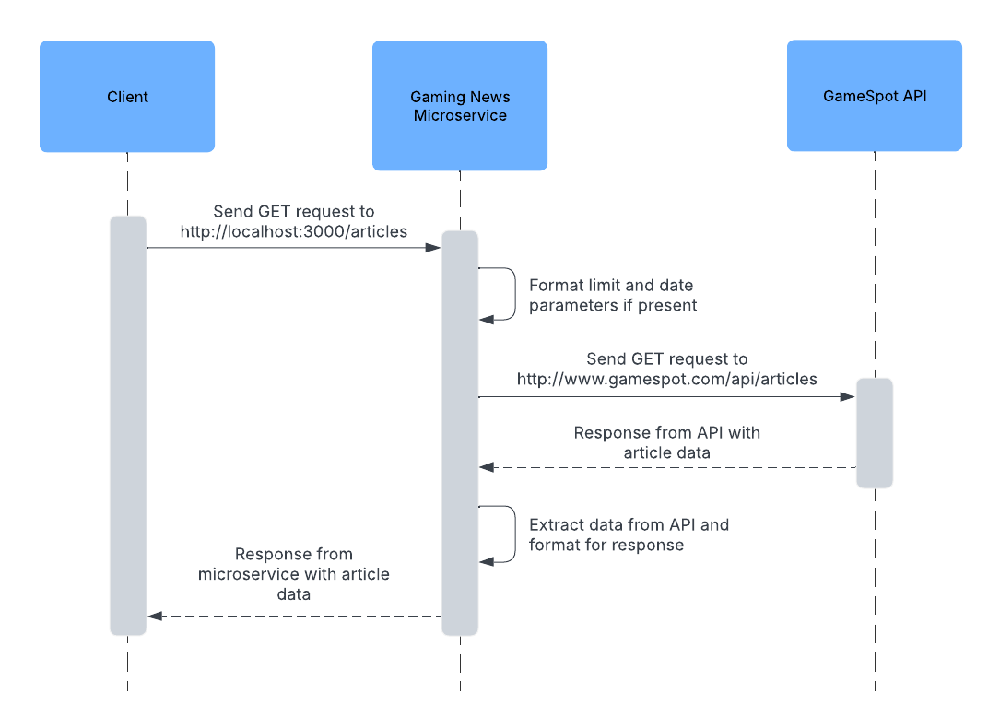

# Gaming News Microservice

A simple microservice for fetching gaming related news using the Gamespot API.

## Installation & Usage

This microservice is intended to be installed and ran on the user's local machine. To install the microservice in the current directory, execute the commands below:

```sh
git clone git@github.com:mjande/gaming-news-microservice.git
cd gaming-news-microservice
npm install
```

You will also need to add an API key from the GameSpot API. A key can be requested by creating an account at [https://www.gamespot.com/api/](https://www.gamespot.com/api/). After copying your key, create a `.env` file in the project root directory and paste it in this file using the following format (adding a port number is optional):

```
API_KEY=abc1234
PORT=3000
```

At this point, you can run a development version of the service by executing `npm run dev`. Or you can build and run a production version by executing:

```sh
npm run build
npm start
```

## Requesting and Receiving Data

After starting up the service on your local machine, requesting and receiving data can be achieved via sending an HTTP request, which will return an HTTP response with the requested data. A request can be sent programmatically using your HTTP client of choice. For example, you can send request using JavaScript's Fetch API:

```js
async function fetchData(limit, date) {
  const params = new UrlSearchParams();

  // Limit and date parameters are both optional
  if (limit) {
    params.append("limit", limit);
  }

  if (date) {
    params.append("date", date);
  }

  return fetch("http:localhost:3000/articles?" + params);
}
```

The HTTP response body will contain the requested articles in JSON format. An example of receiving and extracting the data in a JavaScript program is shown below:

```js
async function getArticles() {
  const result = await fetchData();
  const data = await result.json();
  return result;
}
```

Here is an example of the data if processed using the previous function:

```json
[
    {
        "title":"Lego Game Boy Reportedly Will Cost $60 And Releases This October",
        "description":"The new set looks to be based on the original version of the classic gaming handheld.",
        "url":"https://www.gamespot.com/articles/lego-just-announced-an-official-nintendo-game-boy-set-releases-this-october/1100-6528723/"
    }
]
```

## UML Sequence Diagram

The diagram below demonstrates the flow of execution when requesting and receiving data from the microservice.


